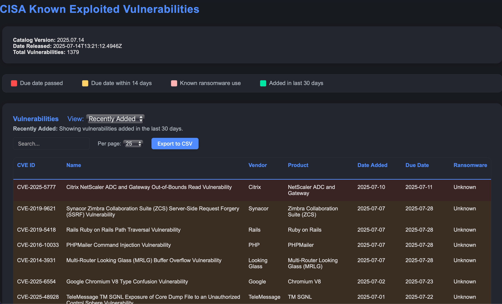

# CISA KEV Dashboard


[](https://github.com/BaDxKaRMa/cisa-kev/actions/workflows/deploy.yml)


A modern, interactive dashboard for monitoring and exploring CISA's Known Exploited Vulnerabilities (KEV) catalog. This project automatically fetches the latest data from CISA and presents it through an accessible, searchable web interface with filtering options, highlights for critical vulnerabilities, and CSV export capabilities.



## 🚀 Features

- **Real-time Data**: Automatically syncs with CISA's official KEV catalog
- **Interactive Filtering**: View recently added, high priority, or all vulnerabilities
- **Advanced Search**: Find vulnerabilities by CVE ID, name, vendor, product, and more
- **Visual Indicators**: Highlights for due dates, ransomware usage, and recently added vulnerabilities
- **CSV Export**: Export filtered results for offline analysis
- **Responsive Design**: Works on desktop and mobile devices
- **Static Site**: Extremely fast loading with no server-side components required

## 📋 Prerequisites

- Python 3.11+
- [uv](https://github.com/astral-sh/uv) for dependency management (recommended)

## 🛠️ Development Setup

1. Clone the repository:

```bash
git clone https://github.com/yourusername/cisa-kev.git
cd cisa-kev
```

2. Install dependencies:

```bash
# Using uv (recommended)
uv sync

# Alternative: Using pip
pip install -e .
```

3. Generate the static site locally:

```bash
uv run python app/generate_static.py
```

4. Test the site locally using Python's built-in server:

```bash
cd site
python -m http.server
```

5. Visit http://localhost:8000 in your browser to view the site.

## 🔄 Project Structure

```
cisa-kev/
├── app/                      # Application code
│   ├── __init__.py
│   ├── data_utils.py         # Data fetching and processing utilities
│   ├── generate_static.py    # Static site generator
│   ├── static/               # Static assets (CSS, JS)
│   │   ├── css/
│   │   └── js/
│   └── templates/            # HTML templates
├── data/                     # Local data storage
│   └── known_exploited_vulnerabilities.json
├── site/                     # Generated static site (ignored in git)
├── .github/                  # GitHub configuration
│   └── workflows/            # GitHub Actions workflows
├── pyproject.toml            # Python project configuration
├── uv.lock                   # uv lock file
└── README.md                 # Project documentation
```

## 🔧 Development Workflow

### Making Changes

1. Modify HTML templates in `app/templates/`
2. Update styles in `app/static/css/styles.css`
3. Enhance JavaScript functionality in `app/static/js/dashboard.js`
4. Run the site generator to see changes:
   ```bash
   uv run python app/generate_static.py
   ```

### Testing

To test the site locally:

```bash
cd site
python -m http.server
```

## 📤 Deployment

The project uses GitHub Actions for automatic deployment to GitHub Pages:

- **Automatic Deployment**: Every push to the `main` branch triggers a build and deployment
- **Scheduled Updates**: The site automatically rebuilds daily to fetch the latest data
- **Manual Deployment**: You can trigger a deployment from GitHub's Actions tab using the workflow_dispatch event

### Setup Your Own Deployment

1. Fork this repository
2. Go to Repository Settings → Pages
3. Set Source to **GitHub Actions**
4. The site will be available at `https://<yourusername>.github.io/cisa-kev/`

## 🧪 Technical Details

### Data Source

The KEV catalog is fetched from CISA's official JSON endpoint:

```
https://www.cisa.gov/sites/default/files/feeds/known_exploited_vulnerabilities.json
```

### Build Process

1. The build process fetches the latest KEV data
2. Jinja2 templates are rendered with the current data
3. Static assets (CSS, JS) are copied to the output directory
4. The complete static site is generated in the `site/` directory
5. GitHub Actions deploys the content to GitHub Pages

## 📄 License

This project is available under the MIT License. See the LICENSE file for details.

## 🙏 Acknowledgements

- [CISA](https://www.cisa.gov/) for providing the KEV catalog data
- [GitHub Pages](https://pages.github.com/) for hosting
- [Jinja2](https://jinja.palletsprojects.com/) for templating

## 📱 Contact

If you have questions or suggestions, please open an issue on GitHub.

---

_Disclaimer: This is an unofficial dashboard and is not affiliated with, endorsed by, or sponsored by CISA. The data is sourced directly from CISA's public feed and presented as-is for educational and informational purposes._
